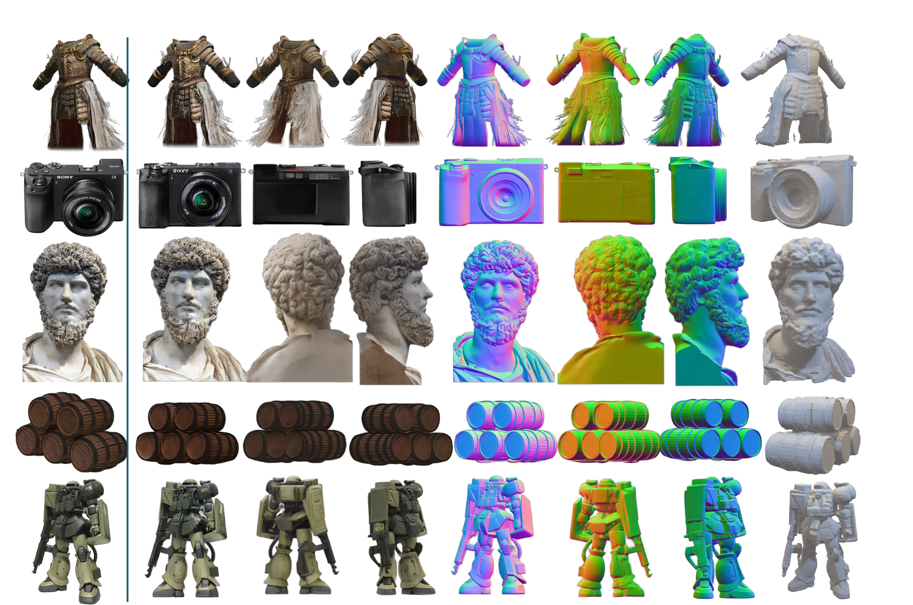

## [NeurIPS2024] Era3D: High-Resolution Multiview Diffusion using Efficient Row-wise Attention

This is the official implementation of *Era3D: High-Resolution Multiview Diffusion using Efficient Row-wise Attention*.

### [Project Page](https://penghtyx.github.io/Era3D/) | [Arxiv](https://arxiv.org/pdf/2405.11616) | [Weights](https://huggingface.co/pengHTYX/MacLab-Era3D-512-6view/tree/main) | <a href="https://huggingface.co/spaces/pengHTYX/Era3D_MV_demo"></a>

https://github.com/pengHTYX/Era3D/assets/38601831/5f927a1d-c6a9-44ef-92d0-563c26a2ce75



### 📝 Update
- __[2024.10.16]__: 🔥 Release the [model](https://huggingface.co/pengHTYX/MacLab-Era3D-512-6view-ortho/tree/main) by removing the focal and elevation regression modules to ensure alignment between the input and generated front-view images for specific applications. See [Inference](#Inference).

### Create your digital portrait from single image

https://github.com/pengHTYX/Era3D/assets/38601831/e663005c-f8df-485e-9047-285c46b3d602

https://github.com/pengHTYX/Era3D/assets/38601831/1dbe75e6-f54a-4321-927d-3234d7568aab
### Installation
```
conda create -n Era3D python=3.9
conda activate Era3D

# torch
pip install torch==2.1.2 torchvision==0.16.2 torchaudio==2.1.2 --index-url https://download.pytorch.org/whl/cu118

# install xformers, download from https://download.pytorch.org/whl/cu118
pip install xformers-0.0.23.post1-cp39-cp39-manylinux2014_x86_64.whl 

# for reconstruciton
pip install git+https://github.com/NVlabs/tiny-cuda-nn/#subdirectory=bindings/torch
pip install git+https://github.com/NVlabs/nvdiffrast

# other depedency
pip install -r requirements.txt
```

### Weights
You can directly download the model from [huggingface](https://huggingface.co/spaces/pengHTYX/Era3D_MV_demo). You also can download the model in python script:
```
from huggingface_hub import snapshot_download
snapshot_download(repo_id="pengHTYX/MacLab-Era3D-512-6view", local_dir="./pengHTYX/MacLab-Era3D-512-6view/")
```

### Inference
1. we generate multivew color and normal images by running [test_mvdiffusion_unclip.py](test_mvdiffusion_unclip.py). For example,
```
python test_mvdiffusion_unclip.py --config configs/test_unclip-512-6view.yaml \
    pretrained_model_name_or_path='pengHTYX/MacLab-Era3D-512-6view' \
    validation_dataset.crop_size=420 \
    validation_dataset.root_dir=examples \
    seed=600 \
    save_dir='mv_res'  \
    save_mode='rgb'
``` 
You can adjust the ```crop_size``` (400 or 420) and ```seed``` (42 or 600) to obtain best results for some cases. 

If you want to keep the input and generated front view consistent, consider using the model trained only on orthogonal data. Please note that this model is only suitable for images with minimal perspective distortions.
```
python test_mvdiffusion_unclip.py --config configs/test_unclip-512-6view-ortho.yaml \
    pretrained_model_name_or_path='pengHTYX/MacLab-Era3D-512-6view-ortho' \
    validation_dataset.crop_size=420 \
    validation_dataset.root_dir=examples \
    seed=600 \
    save_dir='mv_res'  \
    save_mode='rgb'
``` 

2. Typically, we use ```rembg``` to predict alpha channel. If it has artifact, try to use [Clipdrop](https://clipdrop.co/remove-background) to remove the background.

3. Instant-NSR Mesh Extraction
```
cd instant-nsr-pl
bash run.sh $GPU $CASE $OUTPUT_DIR
```
For example, 
```
bash run.sh 0 A_bulldog_with_a_black_pirate_hat_rgba  recon
```
The textured mesh will be saved in $OUTPUT_DIR.

### Training
We strongly recommend using [wandb](https://wandb.ai/site) for logging, so you need export your personal key by 
```
export WANDB_API_KEY="$KEY$"
```

Then, we begin training by 
```
accelerate launch --config_file node_config/8gpu.yaml train_mvdiffusion_unit_unclip.py --config configs/train-unclip-512-6view.yaml
```
### Related projects
We collect code from following projects. We thanks for the contributions from the open-source community!     
[diffusers](https://github.com/huggingface/diffusers)  
[Wonder3D](https://github.com/xxlong0/Wonder3D?tab=readme-ov-file)  
[Syncdreamer](https://github.com/liuyuan-pal/SyncDreamer)  
[Instant-nsr-pl](https://github.com/bennyguo/instant-nsr-pl)  

### License
This project is under [AGPL-3.0](https://www.gnu.org/licenses/agpl-3.0.en.html), so any downstream solution and products that include our codes or the pretrained model inside it should be open-sourced to comply with the AGPL conditions. If you have any questions about the usage of Era3D, please feel free to contact us.

### Citation
If you find this codebase useful, please consider cite our work.
```
@article{li2024era3d,
  title={Era3D: High-Resolution Multiview Diffusion using Efficient Row-wise Attention},
  author={Li, Peng and Liu, Yuan and Long, Xiaoxiao and Zhang, Feihu and Lin, Cheng and Li, Mengfei and Qi, Xingqun and Zhang, Shanghang and Luo, Wenhan and Tan, Ping and others},
  journal={arXiv preprint arXiv:2405.11616},
  year={2024}
}
```